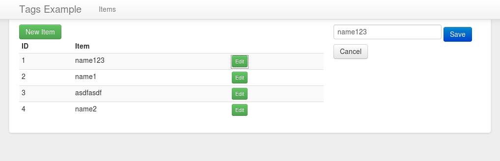

= Tags Example =

== Running the demo ==

On your project root

* git clone https://github.com/bravado/objectiveweb.git
* git clone https://github.com/guigouz/tags.git
* Setup your `ow-config.php` file based on objectiveweb/ow-config.sample.php
    * Set the database server details
    * Add register_app('tags'); to ow-config.php
* Run the SQL Script assets/tags.sql to create the necessary tables

This should be your final layout

    objectiveweb/
        ...
    ow-config.php
    tags/
        _init.php
        index.html
        modules/
            items.html
        ...

== Application Structure ==

The /tags directory contains our application, the only required file is `_init.php` on which we define our data domains.

We'll be using metaproject for the ui, to install it, run

    bower install bravado/metaproject

The UI is structured as follows

* Application modules are stored on the `modules` folder
* All dependencies are loaded on the `index.html` file.
    * Modules are embedded on the main page using the `include` data-binding
    * URLs are defined on the parent element, modules are embedded on the main page using the `include` data-binding
    `

`
* Data Models are defined on `js/models.js`
* Application is initialized at `js/main.js`

